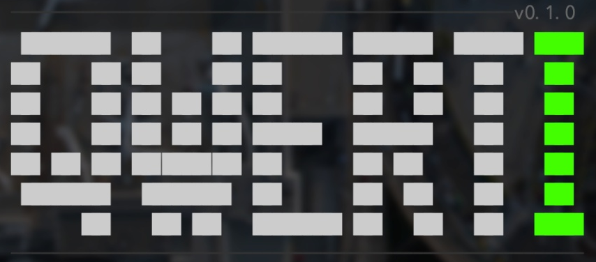

<p align="center">
  
</p>

<h1 align="center">qwerti</h1>

<p align="center">
  Open-source agentic CLI platform built with the <strong>Auto Research</strong> methodology.<br/>
  Supports local models via Ollama/llama.cpp and cloud models via API configuration.<br/>
  Like Claude Code, but you bring your own model.
</p>

<p align="center">
  <a href="https://www.typescriptlang.org/"></a>
  <a href="https://bun.sh"></a>
  <a href="https://react.dev"></a>
  <a href="https://github.com/vadimdemedes/ink"></a>
  <a href="https://modelcontextprotocol.io"></a>
  <a href="https://ollama.com"></a>
  
  
</p>

```
$ qwerti

  qwerti v0.1.0
  Provider: ollama | Model: qwen3:4b

> List all TypeScript files in src/

  - list_dir({ path: "src" })
    Found 12 entries...

  Here are the TypeScript files in src/:
  - index.tsx
  - agent/agent-loop.ts
  - agent/system-prompt.ts
  ...
```

qwerti connects to **Ollama**, **llama.cpp**, **Databricks**, **Azure AI**, **Vertex AI**, or **AWS Bedrock** and gives your model a full set of tools to navigate, read, edit, and search your codebase -- all from the terminal.

---

## Install

### Prerequisites

- [Bun](https://bun.sh) v1.1+
- A model backend: [Ollama](https://ollama.com) (recommended for local), or a cloud provider endpoint

### From source

```bash
git clone https://github.com/your-user/qwerti.git
cd qwerti
bun install
```

### Run

```bash
bun src/index.tsx
```

Or use the dev script:

```bash
bun run dev
```

To skip the intro animation:

```bash
bun src/index.tsx --no-intro
```

---

## Quick start

### 1. Start Ollama (local)

```bash
# Install Ollama if you haven't
curl -fsSL https://ollama.com/install.sh | sh

# Pull a model
ollama pull qwen3:4b
```

### 2. Launch qwerti

```bash
bun run dev
```

### 3. Register your model

Type `/add` in the chat and follow the wizard:

```
/add
  -> Model
  -> Local (GGUF, Ollama, llama-server)
  -> Registrar modelo de Ollama
  -> (select your model from the list)
```

### 4. Start chatting

```
> What files are in this project?
> Read the package.json and tell me the dependencies
> Find all TODO comments in the codebase
```

The model will use tools automatically to answer your questions.

---

## Cloud providers

qwerti supports any OpenAI-compatible endpoint. Use `/add` to register:

```
/add -> Model -> Cloud Provider -> (pick one)
```

| Provider | What you need |
|----------|---------------|
| **Databricks** | Workspace URL, Personal Access Token, serving endpoint name |
| **Azure AI** | Endpoint URL, API key, deployment name |
| **Vertex AI** | GCP project ID, region, model name |
| **AWS Bedrock** | AWS region, access key, model ID |

---

## Tools

The agent has access to these built-in tools:

| Tool | What it does |
|------|-------------|
| `list_dir` | List directory contents with metadata |
| `read_file` | Read file contents |
| `write_file` | Create or overwrite files |
| `edit_file` | Surgical find-and-replace edits |
| `glob` | Find files by pattern (e.g. `**/*.ts`) |
| `grep` | Search file contents with regex |
| `bash` | Execute shell commands |
| `hf_search` | Search HuggingFace for GGUF models |
| `hf_download` | Download models from HuggingFace |

Models that don't support tool calling (like some Ollama models) automatically fall back to plain chat mode.

---

## Commands

Type `/` in the input to see available commands:

| Command | Description |
|---------|-------------|
| `/add` | Add a model, MCP server, skill, or plugin |
| `/models` | Switch between registered models |
| `/remove` | Remove a registered model |
| `/theme` | Cycle through themes (qwerti, ocean, sunset, minimal) |
| `/session` | Manage chat sessions |
| `/resume` | Resume a previous session |
| `/discover` | Detect local backends (Ollama, llama.cpp) |
| `/mcp` | Manage MCP server connections |
| `/skills` | List and manage skills |

---

## Keyboard shortcuts

| Key | Action |
|-----|--------|
| `Enter` | Send message |
| `Tab` | Cycle agent mode (build / plan / research) |
| `Ctrl+H` | Open help dialog |
| `Ctrl+C` | Cancel current generation |
| `Esc` | Close dialog / exit |

---

## MCP support

qwerti implements the [Model Context Protocol](https://modelcontextprotocol.io) for connecting external tool servers:

```
/add mcp my-server npx @my-org/mcp-server
```

MCP tools are automatically available to the agent alongside built-in tools.

---

## Configuration

Config is stored at `~/.qwerti/config.json`:

```json
{
  "activeProvider": "ollama-qwen3:4b",
  "providers": [
    {
      "name": "ollama-qwen3:4b",
      "type": "ollama",
      "model": "qwen3:4b",
      "baseUrl": "http://localhost:11434"
    }
  ],
  "theme": "qwerti",
  "logLevel": "info",
  "plugins": []
}
```

You can edit this file directly or use the `/add` and `/remove` commands.

---

## Project structure

```
src/
  index.tsx                  # Entry point (Commander + Ink)
  core/
    types.ts                 # Shared types (Message, ProviderConfig, etc.)
    event-bus.ts             # Internal event system
    logger.ts                # Pino logger
  agent/
    agent-loop.ts            # Main agent loop (chat -> tool -> chat)
    system-prompt.ts         # System prompt builder
    context-manager.ts       # Context window management
  providers/
    base-provider.ts         # Provider interface
    provider-factory.ts      # Maps config -> provider instance
    model-registry.ts        # Manages registered models
    implementations/
      llama-cpp-provider.ts  # OpenAI-compatible provider (Ollama, llama.cpp, cloud)
  tools/
    base-tool.ts             # Tool interface
    tool-registry.ts         # Manages available tools
    tool-executor.ts         # Executes tool calls
    built-in/                # list_dir, read_file, edit_file, glob, grep, bash, hf_*
  commands/
    built-in/                # /add, /models, /remove, /theme, /session, /discover, /mcp, /skills
  tui/
    app.tsx                  # Main TUI layout
    theme.ts                 # Theme system
    components/              # Ink components (message list, input, dialogs, wizard)
  config/
    global-config.ts         # ~/.qwerti/config.json management
    workspace-config.ts      # Per-project .qwerti/ config
  mcp/
    mcp-manager.ts           # MCP server lifecycle
```

---

## Stack

- **Runtime**: [Bun](https://bun.sh)
- **UI**: [Ink](https://github.com/vadimdemedes/ink) (React for the terminal)
- **Language**: TypeScript
- **LLM protocol**: OpenAI-compatible chat completions (streaming)
- **Tool protocol**: [MCP](https://modelcontextprotocol.io) + built-in tools
- **Schema**: [Zod](https://zod.dev) + zod-to-json-schema

---

## Tested models

| Model | Size | Tool calling | Notes |
|-------|------|:---:|-------|
| qwen3:4b | 4B | Yes | Recommended for local use |
| qwen3.5:0.8b | 0.8B | Yes | Fast, good for simple tasks |
| gemma3:4b | 4B | No | Falls back to chat-only mode |
| databricks-gpt-oss-120b | 120B | Yes | Via Databricks AI Gateway |

---

## License

MIT
